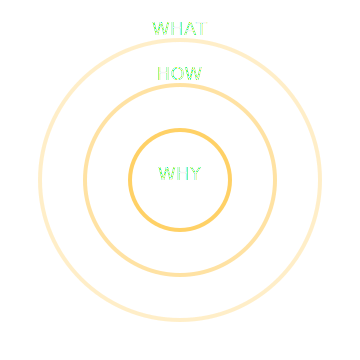

<p align="center">
  
</p>

<h1 align="center">Start With Why – Visual Single‑Page Summary</h1>

<p align="center">
  <strong>A minimalist, Apple‑style, animated visual summary of Simon Sinek’s core ideas.</strong>
</p>

<p align="center">
  <a href="https://knightkar.github.io/start-with-why/"></a>
  <a href="LICENSE"></a>
  <a href="#status"></a>
  <a href="#contributing"></a>
</p>

<p align="center">
  <a href="#overview">Overview</a> · 
  <a href="#live-demo">Live Demo</a> · 
  <a href="#project-structure">Structure</a> · 
  <a href="#concepts-covered">Concepts</a> · 
  <a href="#local-development">Local Dev</a> · 
  <a href="#roadmap">Roadmap</a> · 
  <a href="#contributing">Contributing</a>
</p>

---

## Overview

This project is a **beautifully designed, scroll‑based, animated single‑page website** summarizing  
**_Start With Why_ by Simon Sinek**.

It is built to be:

- A **GitHub Pages–ready** static site  
- A **visual, Apple‑style explanation** of the book’s core ideas  
- A **template** for future visual book summaries  
- A foundation for a future **iOS app** that replaces doomscrolling with learning  

All text is an **original summary**, not copied from the book.

---

## 🚀 Live Demo

👉 **https://knightkar.github.io/start-with-why/**

---

## 📁 Project Structure


start-with-why/

    ├── index.html                         # Single-page layout and content
    ├── styles.css                         # Layout, typography, animations
    ├── script.js                          # Scroll-based animations and interactions
    └── assets/                            # SVG illustrations used in the page
                ├── golden-circle.svg
                ├── diffusion-curve.svg
                ├── brain-diagram.svg
                ├── leadership-icon.svg
                ├── trust-icon.svg
                ├── consistency-icon.svg
                ├── celery-test.svg
                ├── manipulations-vs-inspiration.svg
                └── leadership-expanded.svg


---

## 📘 Concepts Covered

This visual summary covers the major ideas of **Start With Why**, including:

### Core Frameworks
- **The Golden Circle** → WHY → HOW → WHAT  
- **The Biology of Decision‑Making** (limbic vs neocortex)  
- **Trust, Authenticity, and Consistency**  
- **The Law of Diffusion of Innovation**  

### Applied Leadership Concepts
- **Manipulations vs Inspiration**  
- **The Celery Test**  
- **Split Happens** (losing the WHY)  
- **Real‑world examples**  
  - Apple  
  - Southwest Airlines  
  - Harley‑Davidson  
  - The Wright Brothers  
  - Martin Luther King Jr.  

All content is written from scratch and designed to be **clear, visual, and actionable**.

---

## 🛠️ Local Development

Clone the repository:
    
    ```bash
    git clone https://github.com/knightkar/start-with-why.git
    cd start-with-why

---


## Option 1 — Open directly
Just open index.html in your browser.

## Option 2 — Run a local server

    python -m http.server 8000
    # Visit http://localhost:8000


---
## Status
This project is active and part of a larger initiative to build:
A library of visual book summaries
A scroll‑based learning app to replace doomscrolling
An open‑source template for educational visual storytelling

---

## Roadmap
| Phase | Focus | Status |
| --- | --- | --- |
| **v1.0** | Core visual summary + animations | ✅ Complete |
| **v1.1** | Improved SVG diagrams + expanded concepts | ✅ Complete |
| **v1.2** | Add homepage for multiple book summaries | 🔄 Planned |
| **v2.0** | JSON‑driven content system | 🔄 Planned |
| **v3.0** | iOS app version (SwiftUI) | 🔄 Planned |


---
Contributing
PRs are welcome — especially:
New SVG illustrations
Additional book summaries
UI/UX improvements
Accessibility enhancements
Performance optimizations
See [Looks like the result wasn't safe to show. Let's switch things up and try something else!] for usage rights (MIT).
<p align="center">
<sub>If this visual summary helped you understand your WHY, consider giving it a ⭐</sub>
</p>

---


# 🎉 Want me to also update your repo with:

- A centered banner image like your other repo?  
- Shields.io badges for “Made with HTML/CSS/JS”?  
- A navigation table of contents with emojis?  
- A “Screenshots” section with preview images?  
- A “Design Philosophy” section like your other repo?  

Just tell me and I’ll generate it.


